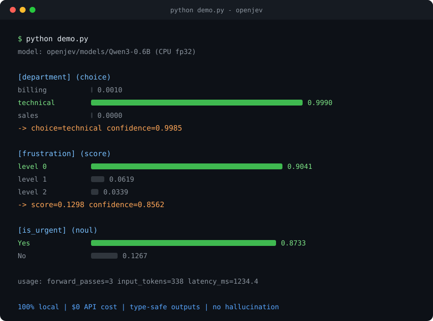

# OpenJev

English | [简体中文](README.zh-CN.md)

**Turn any local LLM into a [Jev](https://jevai.net) — the viral "System One" decision model — running 100% on your machine.**

[](LICENSE)
[](pyproject.toml)
[](https://github.com/lookski/openjev/actions/workflows/ci.yml)
[](#quick-start)

Jev (TypeSafe AI, Sept 2026) made "decision models" viral: send a state + typed questions, get a **type-safe answer with a calibrated probability** — no text generation, no hallucination, 70–500 ms latency.

**OpenJev is the same idea, fully local.** Any small LLM becomes a decision engine via **masked-logit softmax**: one forward pass, mask the answer-token logits, softmax → raw probabilities. Zero API cost. Zero data leaves your machine. Type errors are mathematically impossible.

```
$ python demo.py

state: Hi, I have been trying to connect my Stripe account for 3 days ...
model: openjev/models/Qwen3-0.6B

[department] (choice)
  billing    0.0010
  technical  0.9990
  sales      0.0000
  -> choice=technical confidence=0.9985

[frustration] (score)
  level 0: 0.9041
  level 1: 0.0619
  level 2: 0.0339
  -> score=0.1298 confidence=0.8562

[is_urgent] (noul)
  Yes: 0.8733
  No:  0.1267

usage: forward_passes=3 input_tokens=338 latency_ms=1234.4
```

*(measured output, CPU-only fp32, Qwen3-0.6B — your numbers may differ slightly by version/hardware)*



## Why it works

LLMs already "know" the answer. The problem is the **decoding**: generating text is slow, sampled, and untyped. OpenJev never decodes. It reads the **raw logits** at the first answer position:

| | Jev (cloud) | OpenJev (local) |
|---|---|---|
| Mechanism | parallel samplers (closed) | masked-logit softmax (open) |
| Output | type-safe + probability | type-safe + probability |
| Latency | 70–500 ms | **~0.1–3 s** (one forward pass, no decoding) |
| Cost | $0.042 / M input tokens | **$0** |
| Privacy | data leaves the machine | **100% local** |
| Weights | closed | any open LLM (Qwen, Llama, Phi, ...) |
| Context | 64K | model-dependent (Qwen3: 32K) |
| Hallucination | impossible by design | impossible by design |

The probabilities are **raw softmax values** of the masked logits — not sampled, not prompted for, not parsed from text. That is the honest, model-native confidence.

## Quick start

### Easy mode (zero code, recommended first)

```bash
pip install -e .
openjev-easy          # or: python -m openjev.easy_cli
```

A wizard picks the brain for you: it auto-detects a running **Ollama / LM Studio / vLLM / llama.cpp** server, or takes an **OpenAI / OpenRouter / official Jev** API key (hidden input), runs a smoke test, then drops you into a REPL — paste any text, get typed probabilities back:

```
You> The server is down, we are losing money, fix it NOW.

  intent       #....................... 0.0001
  intent     * ######################## 0.9999
  intent       #....................... 0.0000
  intent       #....................... 0.0000
  -> choice=complaint (confidence 0.9998)

  urgent       Yes #######################. 0.9520
               No  #....................... 0.0480

  sentiment    level 0 #....................... 0.0016
  sentiment    level 1 ##################...... 0.7488
  sentiment    level 2 ######.................. 0.2496
  -> score=1.2480 (confidence 0.6233)
```

*(measured output, built-in engine, Qwen3-0.6B)*

Non-interactive one-shot: `openjev-easy --backend ollama --model qwen3:0.6b --once "some text"`.
All backends — including the official Jev cloud API via `--backend jev` — expose the same interface, so you can A/B them with one flag.

### Full engine (masked softmax, the default deep path)

```bash
pip install -e .
python demo.py
```

First run downloads Qwen3-0.6B (~1.5 GB) from Hugging Face. In China: `export HF_ENDPOINT=https://hf-mirror.com HF_HUB_DISABLE_XET=1`.

### One-liner (library API)

```python
from openjev import Choice, LocalJev, Noul, Score

engine = LocalJev("Qwen/Qwen3-0.6B")           # or a local path
result = engine.system_one(
    "Hi, I have been trying to connect my Stripe account for 3 days ...",
    {
        "department": Choice(
            instructions="Which team should handle this",
            criteria={
                "billing": "Payments, invoices, refunds",
                "technical": "Integration errors, API failures, bugs",
                "sales": "Pricing questions, upgrades, new purchases",
            },
        ),
        "frustration": Score(
            instructions="How frustrated is the customer",
            criteria=["Neutral", "Annoyed", "Angry"],
        ),
        "is_urgent": Noul(instructions="Does this message express urgency?"),
    },
)
print(result["answers"]["department"])   # {'type': 'choice', 'choice': 'technical', ...}
```

### Local server (Jev wire-compatible)

```bash
openjev serve --port 8771
# POST http://127.0.0.1:8771/v1/systemone
curl -s http://127.0.0.1:8771/v1/systemone \
  -H "Content-Type: application/json" \
  -d '{
    "state": "The server is down, we are losing money, fix it NOW.",
    "questions": {
      "urgent":   {"type": "noul",   "instructions": "Does this message express urgency?"},
      "severity": {"type": "score",  "instructions": "How severe is this",
                   "criteria": ["cosmetic", "degraded", "outage"]},
      "route":    {"type": "choice", "instructions": "Which team",
                   "criteria": {"billing": "invoices", "ops": "infrastructure"}}
    }
  }'
```

Response shape matches the official API (`answers` keyed by question id, `noul` has no `confidence`, `score` is the index-weighted mean, `confidence = (K·max_p − 1)/(K − 1)`).

### Two backends, one interface (local softmax ⇄ official Jev API)

```bash
export TYPESAFE_API_KEY=sk-...                      # optional cloud backend
openjev ask --backend jev --state "..." \
  --question '{"urgent":{"type":"noul","instructions":"urgent?"}}'
openjev serve --backend jev                          # wire-compatible Jev proxy
```

```python
from openjev import Choice, LocalJev, RemoteJev

local = LocalJev("Qwen/Qwen3-0.6B")   # free, offline
cloud = RemoteJev()                    # official Jev API, reads $TYPESAFE_API_KEY
# same .system_one(state, questions) — perfect for A/B accuracy & latency tests
```

The remote client retries on 429/5xx with `retry-after` backoff and passes the official `usage` through.

### Deployment

Docker, systemd, Nginx reverse proxy and GPU notes: see [docs/DEPLOY.md](docs/DEPLOY.md). Quick Docker start:

```bash
docker compose up -d openjev     # local backend on :8771, model auto-downloaded
```

## The three primitives

| Primitive | Ask | Answer |
|---|---|---|
| `Choice` | "Which team?" + up to 255 options | `choice`, `probabilities`, `confidence` |
| `Score` | "How frustrated?" + 2–10 ordered levels | `score` (weighted mean), `probabilities`, `confidence`, `legend` |
| `Noul` | "Is this urgent?" | `noul` ∈ [0,1] ("yes" probability) |

## Recommended models (fast TTFT)

TTFT dominates perceived latency of decision workloads. On a decision engine you never decode, so TTFT **is** the whole latency — pick a small, well-trained model:

| Model | Size | RAM (fp32) | Notes |
|---|---|---|---|
| `Qwen/Qwen3-0.6B` | 0.6B | ~3 GB | **default** — fastest CPU TTFT, strong English instruction following |
| `Qwen/Qwen3-1.7B` | 1.7B | ~7 GB | better calibration on hard cases |
| `Qwen/Qwen3-4B-Instruct-2507` | 4B | ~16 GB | best accuracy; GPU recommended |
| `microsoft/Phi-4-mini-instruct` | 3.8B | ~15 GB | strong alternative, permissive MIT |
| `meta-llama/Llama-3.2-1B-Instruct` | 1B | ~5 GB | good Llama ecosystem choice |
| `openai/gpt-oss-20b` | 20B MoE | ~13 GB (MXO) | native MXFP4, ~3.8B active params, GPU recommended |

**How to choose:** CPU-only → stay ≤ 2B. One consumer GPU (8 GB+) → 4B class. Multi-GPU → 20B MoE.

Measure it yourself:

```bash
python -m openjev.cli ask --state "server down, losing money" \
  --question '{"urgent":{"type":"noul","instructions":"Is this urgent?"}}' \
  --model Qwen/Qwen3-0.6B --json
```

## Patterns (from the official Jev docs)

- **Confidence-Gated Routing** — low confidence → human, high confidence → act:
  ```python
  ans = result["answers"]["action"]
  if ans["confidence"] < 0.5:
      route_to_human()
  elif ans["choice"] == "approve_transfer" and ans["confidence"] > 0.9:
      execute()
  ```
- **Speculative Fan-Out** — ask 20 questions in one request, read the 3 you need.
- **Composite Scoring** — sum weighted `Score` answers into one composite index.

## Project layout

```
openjev/
  types.py    # Choice / Score / Noul, wire schema, confidence + score math
  core.py     # LocalJev engine: masked-logit softmax over the answer tokens
  server.py   # stdlib HTTP server, POST /v1/systemone (Jev wire-compatible)
  cli.py      # openjev ask / serve / models
tests/        # pytest; engine tests auto-skip without weights
demo.py       # end-to-end demo on the canonical Jev ticket example
```

## Party trick: the yin-yang detector

```bash
python examples/fun_yinyang.py        # --text "your message" for custom input
```

Measured with the default 0.6B brain (real run output):

| message | yin-yang | vibe |
|---|---|---|
| `哦` | 0.8424 | sincere 0.9802 |
| `好的，都可以，你决定就好` | 0.7837 | sincere 0.9904 |
| `6` | 0.8751 | sincere 0.9790 |
| `今天天气真好，一起去吃火锅吧` | 0.7155 | sincere 0.9951 |

Yes, it rates everything at ~70-88% sarcasm while simultaneously insisting the sender is 98% sincere. **The model itself is the most yin-yang thing here** - and that is exactly why raw probabilities beat hard labels: you can see the contradiction instead of trusting a single verdict.

## Limitations (honest section)

- **Prompt sensitivity**: the absolute numbers depend on prompt phrasing. The distribution is model-native, but calibration is not RL-trained like Jev's RLCD.
- **English-first**: like Jev, decision quality is best on English prompts (small-model multilingual ability is weaker).
- **No reasoning**: questions should be answerable at first token; for multi-step problems use an LLM agent, not a System One engine.
- **First forward pass only**: OpenJev reads the logits at the answer position. It does not generate a chain of thought first — that is the point, and also the limitation.

## FAQ

**Q: Is this the real Jev?** No. Jev is a closed model trained with RLCD specifically for calibrated decisions. OpenJev is a **local reimplementation of the interface and mechanism** — same wire format, same primitives, probabilities computed the same honest way (masked softmax over answer tokens), using whatever open LLM you point it at.

**Q: Can I use bigger models?** Yes — pass `--model` any HF causal LM id or local path. Bigger models shift the probabilities, not the mechanism.

**Q: Does my data leave the machine?** Never. The model runs locally; the server binds to `127.0.0.1` by default.

**Q: Windows / macOS / Linux?** All fine. CPU-only works; CUDA/MPS auto-detected if present.

## Star history note

If OpenJev saved you from paying for decision-model APIs, drop a ⭐ — it keeps a broke grad student in GPUs.

## License

MIT
