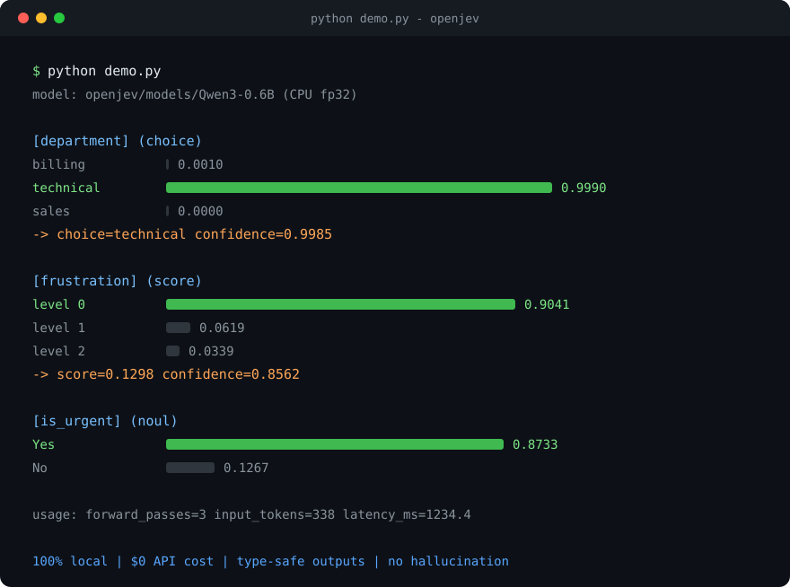

# OpenJev

[English](README.md) | 简体中文

**把任意本地 LLM 变成 [Jev](https://jevai.net) 式的 "System One" 决策模型, 100% 跑在你自己的机器上.**

> **30 秒版本.** 决策模型不聊天 —— 你发一段状态 (state) 加若干类型化问题 ("哪个团队处理?", "有多紧急?"), 它返回**带校准概率的类型安全答案**: 不生成自由文本, 没有幻觉, 单次前向传播. [Jev](https://jevai.net) 把这个概念做成了闭源云 API 并刷屏. **OpenJev 是开源版**: 可以指向一个本地小模型 (掩码 logit softmax, $0, 数据不出机器), 也可以指向任何你已有 key 的 OpenAI 兼容 API (OpenAI / OpenRouter / DeepSeek / Groq / 自建 vLLM...), 还可以指向 Jev 官方云 —— 接口完全一致, 一个参数就能切换. 路由, 工单分派, 置信度门控, 不用为每次决策付费, 也不用泄露数据.

[](LICENSE)
[](pyproject.toml)
[](https://github.com/lookski/openjev/actions/workflows/ci.yml)
[](#快速开始)

Jev (TypeSafe AI, 2026 年 9 月) 让 "决策模型" 一词刷屏: 发送一段状态 (state) + 若干类型化问题, 返回**带校准概率的类型安全答案** —— 不生成文本, 没有幻觉, 70–500 ms 延迟.

**OpenJev 用纯本地方案复刻了同一个思路.** 任意小参数 LLM 通过**掩码 logit softmax** 变成决策引擎: 一次前向传播, 掩掉答案 token 之外的 logits, softmax 得到原始概率. 零 API 费用, 数据不出机器, 类型错误在数学上不可能发生.

```
$ python demo.py

state: Hi, I have been trying to connect my Stripe account for 3 days ...
model: openjev/models/Qwen3-0.6B

[department] (choice)
  billing    0.0010
  technical  0.9990
  sales      0.0000
  -> choice=technical confidence=0.9985

[frustration] (score)
  level 0: 0.9041
  level 1: 0.0619
  level 2: 0.0339
  -> score=0.1298 confidence=0.8562

[is_urgent] (noul)
  Yes: 0.8733
  No:  0.1267

usage: forward_passes=3 input_tokens=338 latency_ms=1234.4
```

*(实测输出, CPU fp32, Qwen3-0.6B, 你的硬件与版本下数字可能略有差异)*



## 原理

LLM 其实已经 "知道" 答案, 问题出在**解码方式**: 生成文本又慢又不稳定, 还没有类型. OpenJev 完全不解码, 它直接读取第一个答案位置的**原始 logits**:

| | Jev (云端) | OpenJev (本地) |
|---|---|---|
| 机制 | 并行采样器 (闭源) | 掩码 logit softmax (开源) |
| 输出 | 类型安全 + 概率 | 类型安全 + 概率 |
| 延迟 | 70–500 ms | **约 0.1–3 s** (单次前向, 无解码) |
| 成本 | $0.042 / 百万输入 token | **$0** |
| 隐私 | 数据出机器 | **100% 本地** |
| 权重 | 闭源 | 任意开源 LLM (Qwen / Llama / Phi / ...) |
| 上下文 | 64K | 取决于模型 (Qwen3: 32K) |
| 幻觉 | 设计上不可能 | 设计上不可能 |

这些概率是掩码 logits 的**原始 softmax 值** —— 不是采样出来的, 不是提示词逼出来的, 也不是从文本里解析出来的. 这就是模型原生的, 诚实的置信度.

## 三种大脑, 随便换

| 大脑 | 引擎 | 需要 | 成本 | 隐私 |
|---|---|---|---|---|
| **本地模型** (默认) | `LocalJev` —— 掩码 logit softmax | 任意 HF 因果 LM 或本地路径 (0.6B 约占 3 GB 内存) | $0 | 数据不出机器 |
| **OpenAI 兼容 API** | `OpenAICompatJev` —— 首 token top-logprobs | 一个 key 或本地服务: OpenAI / OpenRouter / DeepSeek / Groq / Together / Ollama / LM Studio / vLLM / llama.cpp | 按 token 计费 (自建免费) | 视服务商而定; 自建不出机器 |
| **Jev 官方云** | `RemoteJev` —— 同构客户端 | `$TYPESAFE_API_KEY` | Jev 定价 | 数据出机器 |

三者暴露同一个 `.system_one(state, questions)` / `POST /v1/systemone` 接口 —— 一个参数切换, 零代码改动即可 A/B 准确率与延迟.

> **诚实边界:** API 后端从响应的 `logprobs` 里读概率, 所以要求服务商返回 logprobs. OpenAI 兼容端点都返回; **Anthropic 的 API 不暴露 logprobs, 因此无法作为 OpenJev 后端** —— 这是他们 API 的属性, 不是本设计的局限.

## 快速开始

### 傻瓜模式 (零代码, 推荐先跑这个)

```bash
pip install -e .
openjev-easy          # 或者: python -m openjev.easy_cli
```

向导自动帮你选大脑: 自动探测本机正在运行的 **Ollama / LM Studio / vLLM / llama.cpp** 服务, 或者输入 **OpenAI / OpenRouter / 官方 Jev** 的 API key (隐藏输入), 冒烟测试通过后进入交互界面, 粘贴任意文本就返回类型化概率:

```
You> The server is down, we are losing money, fix it NOW.

  intent       #....................... 0.0001
  intent     * ######################## 0.9999
  intent       #....................... 0.0000
  intent       #....................... 0.0000
  -> choice=complaint (confidence 0.9998)

  urgent       Yes #######################. 0.9520
               No  #....................... 0.0480

  sentiment    level 0 #....................... 0.0016
  sentiment    level 1 ##################...... 0.7488
  sentiment    level 2 ######.................. 0.2496
  -> score=1.2480 (confidence 0.6233)
```

*(实测输出, 内置引擎, Qwen3-0.6B)*

非交互单次调用: `openjev-easy --backend ollama --model qwen3:0.6b --once "some text"`.

**全部八个后端** (指定 `--backend` 时跳过向导菜单):

| `--backend` | 连接到 | key / 备注 |
|---|---|---|
| `local` | 进程内掩码 logit softmax | 需下载模型 (默认) |
| `ollama` | `localhost:11434/v1` | 你已在跑的 Ollama |
| `lmstudio` | `localhost:1234/v1` | 你已在跑的 LM Studio |
| `llamacpp` | `localhost:8080/v1` | llama.cpp server |
| `vllm` | `localhost:8000/v1` | 自建 vLLM |
| `openai` | `api.openai.com/v1` | `$OPENAI_API_KEY` |
| `openrouter` | `openrouter.ai/api/v1` | `$OPENROUTER_API_KEY`; 数百个模型含免费档 |
| `jev` | TypeSafe Jev 官方云 | `$TYPESAFE_API_KEY` |

其他任何 OpenAI 兼容服务 (DeepSeek / Groq / Together / 挂在域名后面的自建 vLLM) 用 `--base-url` 接入:

```bash
openjev-easy --backend openai --base-url https://api.deepseek.com/v1 \
  --model deepseek-chat --api-key sk-... --once "text"
```

库里的等价写法 —— 一个工厂函数, 任意大脑:

```python
from openjev.easy import make_engine

engine = make_engine("vllm", model="Qwen/Qwen3-0.6B", base_url="http://gpu-box:8000/v1")
# 和 LocalJev / RemoteJev 同一个 .system_one(state, questions) —— 大脑随便换
```

所有后端接口完全一致, 一个参数就能本地 ⇄ 云端 A/B 对比.

> API 后端从首个生成 token 的 `logprobs` 里读概率 —— 这就是它们要求 OpenAI 兼容端点的原因 (Anthropic 的 API 不暴露 logprobs). 没有 logprobs 就没有诚实的概率: 后端会直接拒绝, 而不是编造数字.

### 完整引擎 (掩码 softmax, 默认深度路径)

```bash
pip install -e .
python demo.py
```

首次运行会从 Hugging Face 下载 Qwen3-0.6B (约 1.5 GB). 国内环境: `export HF_ENDPOINT=https://hf-mirror.com HF_HUB_DISABLE_XET=1`, 或直接用 `python scripts/download_model.py` (已内置镜像与 Xet 开关).

### 一行代码 (库 API)

```python
from openjev import Choice, LocalJev, Noul, Score

engine = LocalJev("Qwen/Qwen3-0.6B")           # 或本地模型路径
result = engine.system_one(
    "Hi, I have been trying to connect my Stripe account for 3 days ...",
    {
        "department": Choice(
            instructions="Which team should handle this",
            criteria={
                "billing": "Payments, invoices, refunds",
                "technical": "Integration errors, API failures, bugs",
                "sales": "Pricing questions, upgrades, new purchases",
            },
        ),
        "frustration": Score(
            instructions="How frustrated is the customer",
            criteria=["Neutral", "Annoyed", "Angry"],
        ),
        "is_urgent": Noul(instructions="Does this message express urgency?"),
    },
)
print(result["answers"]["department"])   # {'type': 'choice', 'choice': 'technical', ...}
```

### 本地 HTTP 服务 (与 Jev 官方接口同构)

```bash
openjev serve --port 8771
# POST http://127.0.0.1:8771/v1/systemone
curl -s http://127.0.0.1:8771/v1/systemone \
  -H "Content-Type: application/json" \
  -d '{
    "state": "The server is down, we are losing money, fix it NOW.",
    "questions": {
      "urgent":   {"type": "noul",   "instructions": "Does this message express urgency?"},
      "severity": {"type": "score",  "instructions": "How severe is this",
                   "criteria": ["cosmetic", "degraded", "outage"]},
      "route":    {"type": "choice", "instructions": "Which team",
                   "criteria": {"billing": "invoices", "ops": "infrastructure"}}
    }
  }'
```

响应结构与官方 API 对齐 (answers 按问题 id 键控, noul 没有 confidence 字段, score 是等级下标的加权均值, `confidence = (K·max_p − 1)/(K − 1)`).

### 双后端, 同一接口 (本地 softmax ⇄ 官方 Jev API)

> 完整后端菜单 (含各 OpenAI 兼容 API) 见上方傻瓜模式和 [`openjev/easy.py`](openjev/easy.py) 的 `make_engine()`. 本节是库层面的 本地 ⇄ Jev 官方云 组合.

```bash
export TYPESAFE_API_KEY=sk-...                       # 可选的云端后端
openjev ask --backend jev --state "..." \
  --question '{"urgent":{"type":"noul","instructions":"urgent?"}}'
openjev serve --backend jev                          # 成为 Jev 云 API 的同构代理
```

```python
from openjev import Choice, LocalJev, RemoteJev

local = LocalJev("Qwen/Qwen3-0.6B")   # 免费离线
cloud = RemoteJev()                    # 官方 Jev API, 自动读 $TYPESAFE_API_KEY
# 同一个 .system_one(state, questions), A/B 准确率与延迟对比一步到位
```

Remote 客户端: 从 `$TYPESAFE_API_KEY` 读密钥, 429/5xx 按 `retry-after` 自动退避, 透传官方 `usage`.

### 部署

Docker / systemd / Nginx 反代 / GPU 加速: 见 [docs/DEPLOY.md](docs/DEPLOY.md). Docker 快速启动:

```bash
docker compose up -d openjev     # 本地后端, 端口 8771, 模型自动下载
```

## 三种问题原语

| 原语 | 问什么 | 返回什么 |
|---|---|---|
| `Choice` | "哪个团队处理?" + 最多 255 个选项 | `choice`, `probabilities`, `confidence` |
| `Score` | "用户多愤怒?" + 2–10 个有序等级 | `score` (加权均值), `probabilities`, `confidence`, `legend` |
| `Noul` | "紧急吗?" | `noul` ∈ [0,1] ("是" 的概率) |

## 推荐模型 (快 TTFT)

决策类负载的感知延迟由 TTFT 主导. 决策引擎从不解码, 所以 TTFT **就是全部延迟**, 优先选训练充分的小模型:

| 模型 | 参数量 | 内存 (fp32) | 说明 |
|---|---|---|---|
| `Qwen/Qwen3-0.6B` | 0.6B | 约 3 GB | **默认**, CPU 上 TTFT 最快, 指令跟随好 |
| `Qwen/Qwen3-1.7B` | 1.7B | 约 7 GB | 难例上校准更好 |
| `Qwen/Qwen3-4B-Instruct-2507` | 4B | 约 16 GB | 准确率最好, 建议 GPU |
| `microsoft/Phi-4-mini-instruct` | 3.8B | 约 15 GB | 强力替代, MIT 许可 |
| `meta-llama/Llama-3.2-1B-Instruct` | 1B | 约 5 GB | Llama 生态之选 |
| `openai/gpt-oss-20b` | 20B MoE | 约 13 GB (MXO) | 原生 MXFP4, 激活参数约 3.8B, 建议 GPU |

**怎么选**: 只有 CPU → 不超过 2B; 一张消费级 GPU (8 GB+) → 4B 档; 多卡 → 20B MoE.

自己动手测:

```bash
python -m openjev.cli ask --state "server down, losing money" \
  --question '{"urgent":{"type":"noul","instructions":"Is this urgent?"}}' \
  --model Qwen/Qwen3-0.6B --json
```

## 官方模式 (来自 Jev 文档)

- **Confidence-Gated Routing (置信度门控路由)**, 低置信度转人工, 高置信度自动执行:
  ```python
  ans = result["answers"]["action"]
  if ans["confidence"] < 0.5:
      route_to_human()
  elif ans["choice"] == "approve_transfer" and ans["confidence"] > 0.9:
      execute()
  ```
- **Speculative Fan-Out (投机扇出)**, 一次请求问 20 个问题, 代码只读需要的 3 个.
- **Composite Scoring (复合打分)**, 多个原子 Score 加权合成一个综合指数.

## 项目结构

```
openjev/
  types.py    # Choice / Score / Noul, 接口 schema, confidence 与 score 数学
  core.py     # LocalJev 引擎: 答案 token 上的掩码 logit softmax
  server.py   # 标准库 HTTP 服务, POST /v1/systemone (与 Jev 接口同构)
  cli.py      # openjev ask / serve / models
tests/        # pytest; 无模型权重时引擎冒烟测试自动跳过
demo.py       # 用 Jev 官方工单示例做端到端演示
```

## 节目效果: 阴阳怪气鉴定器

**🚀 免安装, 浏览器直接玩: [在线 Demo](https://linrin0306-openjev-detector.static.hf.space)** — 纯前端 Hugging Face Space (transformers.js, WebGPU fp16 高精度 / WASM q4f16 快速模式自动回退, 推理全程在你设备上, 消息不上传服务器)。

```bash
python examples/fun_yinyang.py        # --text "你的消息" 自定义输入
```

默认 0.6B 大脑实测输出 (真实运行结果):

| 消息 | 阴阳怪气 | 语气 |
|---|---|---|
| `哦` | 0.8424 | sincere 0.9802 |
| `好的，都可以，你决定就好` | 0.7837 | sincere 0.9904 |
| `6` | 0.8751 | sincere 0.9790 |
| `今天天气真好，一起去吃火锅吧` | 0.7155 | sincere 0.9951 |

没错, 它把所有话都判成约 70-88% 的讽刺, 同时又坚持说话人 98% 是真心的. **这个模型自己才是全场最阴阳的** —— 而这恰恰证明了为什么要原始概率而不是硬标签: 矛盾看得见, 而不是一个黑箱判决.

### 群聊战况雷达: 谁下一句要炸?

```bash
python examples/fun_chat_radar.py          # 默认老板-实习生剧本
# 或者: python examples/fun_chat_radar.py --file chat.txt   (每行 "名字: 消息")
```

默认剧本实测输出:

```
===== per-speaker radar =====
  小王    msgs=3  hostility=0.192  explode=0.951  yinyang=0.961
  老板    msgs=3  hostility=0.132  explode=0.904  yinyang=0.894

===== next to explode (top 3) =====
  1. 小王  peak-explode 0.982 on: "嗯"
```

在模型眼里**全员爆炸概率 90%+**, 而全群最危险的一句话是, `嗯`. 说真的, 这判断没毛病.

### 追人雷达: 这条消息到底发不发?

```bash
python examples/fun_crush_radar.py --file chat.txt   # 两个人, 每行 "名字: 消息"
```

粘贴你和追的人的聊天记录, 每条消息会得到兴趣分 (0-3), 好感概率和敷衍概率, 最后给出一个行动建议: **冲 / 稳 / 缓 / 停**. 两段 demo 对话, 默认 0.6B 大脑实测输出:

| 对方回复 | 对方兴趣 | 你的 | 判定 |
|---|---|---|---|
| `我看看有没有时间吧` / `嗯` / `没干嘛, 就是挺忙的` | 0.06/3 | 0.73/3 | **缓** —— 对方投入明显低于你 (差值 −0.67), 把话题交回去 |
| `去呀! 那我们一起呗` / `太好了, 那说定了` | 0.62/3 | 0.40/3 | **稳** —— 趋势平稳, 双方接近; 下一段再决定 |

判定只使用**相对**信号 (兴趣差 + 趋势方向) —— 玩具模型会把中文短消息的绝对分压进很窄的区间 (它给几乎一切都打 ~0.9 的敷衍率, 和阴阳鉴定器给一切都打阴阳是同一个特性), 绝对阈值毫无意义. 诚实的数字进, 诚实的保留态度出.

刻意不做微信/QQ 集成: 自动读取聊天软件有封号风险. OpenJev 只读**你手动粘贴**的内容, 多一行都不碰.

### 追人雷达 · 严肃版: 全上下文大模型引擎 + 机器人 hub

0.6B 的 token 概率是节目效果. 想要真正能拿来决策的判定, 把雷达指向**大模型 API** —— 引擎与服务商无关, **不内置任何端点和默认模型**.

**配一次, 永久生效** (命令行向导或 hub 网页面板均可; 配置存在 `~/.openjev/llm.json`, 权限 0600):

```bash
python -m openjev.llm_config            # 向导: 填 base URL, 自动拉 /models 列表选一个, 连通测试, 保存
# 或者非交互:
python -m openjev.llm_config --base-url https://api.deepseek.com/v1 --model deepseek-chat --api-key sk-...
```

向导会拉取端点的 `/models` 列表让你从真实存在的模型里选, 跑一个单词的连通性测试, 通过才保存. 之后所有命令和 hub 都直接读这份配置 —— 不需要环境变量 (`OPENJEV_LLM_BASE_URL/MODEL/API_KEY` 和 CLI 参数仍可临时覆盖). `--status` 查看当前配置 (key 掩码显示).

整段对话**带上下文**送进去, 返回结构化 JSON: 判定 (冲/稳/缓/停) + 兴趣分 + 趋势 + 好感信号 + **回复方向** (策略一句, 如 "敲定时间地点+抛二选一细节") + 下一步建议 (可直接抄的话术) + 理由 (以下为实测输出):

```text
#   低兴趣对话  -> 对方 0.4/3, 趋势 falling -> 停: "她连续用敷衍、拒绝和'挺忙的'收尾, 没有一次反问或主动"
#   高兴趣对话  -> 对方 2.9/3, 趋势 rising  -> 冲: "她主动提议同行、敲定时间地点还回请吃饭"
#   边缘对话    -> 对方 1.3/3, 趋势 flat    -> 稳: "邀约时用'看情况+可能加班'打太极"
#   升温对话    -> 对方 2.7/3, 趋势 rising  -> 冲: "应趁热把时间地点钉死防止鸽掉" + 下一步建议
```

判定里带 `next_advice` —— 不只是数字, 还有下一条消息的具体建议. 已对罗噪服务商加固: `response_format: json_object` 带回退, 外加逐键打捞解析器 (能从截断/乱码补全里恢复判定).

### 微信雷达: 截图进, 判定出 (悬浮窗)

粘贴 UI 能用, 但切窗口粘贴太麻烦. `openjev/wechat_radar.py` 是一个常驻顶层的**悬浮小窗**, 内置剪贴板自动监听: 在微信里截图, 判定自己弹出来.

```bash
python -m openjev.wechat_radar      # 悬浮窗出现, 常驻置顶, 自动监听中
```

**自动模式 (默认, 零按键):** 截图聊天区 (`Alt+A` / `Win+Shift+S`) 或多选消息 → 复制 —— 悬浮窗感知到剪贴板新内容后自动跑完整链路 (本地 OCR → 还原对话 → 大模型判定 → 冲/稳/缓/停 大字上屏). 非聊天内容静默忽略 (文本需过 2 行发言 + 中文字量的相似度门槛, 小于 200×80 的图片跳过), 正常复制不会触发误分析.

手动热键保留, 可强制分析任意内容: **Ctrl+F2** (剪贴板文字) / **Ctrl+F3** (剪贴板截图). 点结果区复制判定; 拖标题移动; 双击切紧凑模式; 右键关闭. `--no-auto` 关闭监听 (仅热键), `--poll-ms` 调监听间隔.

悬浮窗不碰微信本身 —— 无 hook, 无自动化, 不读微信内存. 监听只查一个序列号 (零开销), 内容变化时才读一次剪贴板, 和你自己粘贴等价. 截图全程在内存 (不落盘). OCR 在本地; 只有识别出的文字会发给你配置的 LLM 端点 (隐私提示同上).

已知 OCR 下限: `嗯` 这类单字气泡低于 OCR 检测阈值可能漏掉 —— 可以接受, 一个字的回复很少翻转判定.

### 微信助手: 来消息自动判定 + 草稿建议

雷达还需要你截图. `openjev/wechat_assistant.py` 更进一步: **盯住指定会话的新来消息**, 全流程自动跑.

```bash
python -m openjev.wechat_assistant --who 她的备注名     # 监听一个会话
python -m openjev.wechat_assistant --who 甲,乙          # 监听多个
python -m openjev.wechat_assistant --no-draft            # 只弹判定, 不写草稿
```

被监听的人一来消息, 悬浮窗自动弹出 冲/稳/缓/停 判定, 并把**建议回复以草稿态粘贴到该会话的输入框** —— 你过目后按回车发送 (或清掉). 没有你的回车永远不会发出去, 这是硬边界.

原理与不做什么:

- 基于 [wxauto4](https://docs.wxauto.org/) (Windows UI Automation): OpenJev 读你自己已登录客户端的屏幕聊天窗口, 往输入框写内容, 和你亲手用鼠标键盘操作一样. **不注入 DLL, 不读内存, 不逆向协议** —— 2025 年大规模封号的那批技术一律不碰. UI 自动化是个人微信现存风险最低的接入方式; 但它仍是第三方非官方方案, 请只用自己有权的会话 (先用 文件传输助手 试), 频率保持像人.
- 新消息检测是双通道: wxauto 回调 + 独立的轮询比对兑底, 回调失明时助手不会聋.
- 你自己发出的消息不会被判定 (只有来消息触发分析).
- 每次写草稿前后会保存并还原你的剪贴板, 你复制的东西不受影响.
- 隐私形态与雷达一致: 全程本地, 只有 transcript 发给你配置的 LLM.
- 需要 Windows + 微信 PC 4.x 已登录; `pip install wxauto4` (免费版, ≥41.1.7 自带 cp313 wheel 支持 Python 3.13). 偶发 "未找到已登录的客户端主窗口" 会自动重试.

### QQ 助手: OneBot 11 实时判定 (比微信好做)

QQ 天生适合实时分析: NTQQ 生态的 NapCat 实现 OneBot 11 协议, 消息以结构化 JSON 事件推送 —— 不用 OCR, 不用 UI 自动化, 连你自己发出的消息都能收到, **双向上下文完整**.

```bash
python -m openjev.qq_assistant --ws ws://127.0.0.1:3001   # NapCat forward WS
python -m openjev.qq_assistant --watch 10086              # 只盯一个 QQ 号 (默认全部私聊)
python -m openjev.qq_assistant --selftest                 # 没装 NapCat 也能全链路自测
```

前置: 安装 NapCat 并开启 forward WebSocket (默认 3001 端口). 对方连发消息不会逐条判定 —— 每静默 `--quiet-secs` 秒 (默认 6) 才对最近 `--context` 条 (默认 30) 跑一次判定. `--send-reply` 可把建议发回该会话, 默认关 (只提示不代发, 与微信助手同一条硬边界).

诚实声明: NapCat 是第三方注入式实现, 存在理论封号风险 (历史上 QQ 对它宽容得多); 担心就用小号. 官方 q.qq.com 机器人读不了好友私聊, 这个场景做不了. 本模块默认不给对方发任何消息.

### Telegram 助手: 最干净的一条路 (官方 API, 还能回填历史)

Telegram 官方开放 MTProto 用户 API —— 以**你自己的账号**登录合法第三方客户端 (与 Telegram Desktop 同级, 无注入无 hook), 双向消息实时收, 启动时还能把**最近的历史消息直接回填进上下文** (QQ/微信都做不到):

```bash
python -m openjev.tg_assistant --login     # 一次性登录 (my.telegram.org 拿 api_id/api_hash)
python -m openjev.tg_assistant             # 全部私聊实时判定
python -m openjev.tg_assistant --watch 123456789 --backfill 50 --push http://127.0.0.1:8793/api/verdict
python -m openjev.tg_assistant --selftest  # 不登录全链路自测
```

事件内核复用 QQ 助手 (OneBot 形状映射), 静默去抖/判定/--push 语义一致. 群组忽略, 只看私聊.

其他平台可行性 (诚实对照): **Discord** 官方 bot 读不了你的私聊, 读私聊的自助 bot 违 ToS 会封号; **WhatsApp** 无官方个人 API, 只能 WhatsApp Web 自动化 (风险等级同微信 UI 自动化) 或 Baileys 协议复刻 (风险同 hook); **LINE/KakaoTalk** 官方 API 仅服务号, 无路; **Signal** 可官方"链接设备"但仅一对一链接限制多; **iMessage** 仅 macOS AppleScript. 结论: Telegram > QQ > 微信 > WhatsApp > 其他.

**聊天窗内嵌卡片 (`qq_overlay`)**: 分析直接叠在指定聊天窗消息区末尾, 视觉上就是 "对方消息后面跟着分析":

```bash
# 先把和她的聊天弹成独立窗口 (会话列表双击她, 或右键 -> 在独立窗口中打开)
python -m openjev.qq_overlay --who 她的备注名
```

卡片是半透明置顶覆盖层, 跟随聊天窗移动/缩放; 冲/稳/缓/停 + 兴趣分 + 理由 + 下一步, 点卡片即复制建议; 点 **[+ 详情]** 或双击展开完整报告 (大字号 + 复制/收起按钮). **不 hook 不注入, QQ 进程完全无感** —— 视觉内嵌用覆盖层就够, 不需要冒注入的险. 事件仍来自 NapCat; `--selftest` 可无 NapCat 全链路自测. 想把分析真正渲染进消息流 DOM 属于 LiteLoaderQQNT 插件路线 (注入式, 本项目不做).

**机器人 hub** (粘贴 UI + 聊天平台桥接, 一个进程):

```bash
python -m openjev.crush_bot --port 8792       # 然后打开 http://127.0.0.1:8792
```

- `POST /api/analyze` `{chat, you, them}` —— 内置粘贴 UI 用的路由
- `POST /qq` / `POST /wechat` —— 同样契约, 给你自己运营的聊天平台中转用: 平台侧 (QQ 官方机器人 webhook, 微信桥) 把对话 POST 过来, hub 返回格式化的判定文本. 微信侧刻意**不内置自动收消息** (hook 有封号风险); QQ 侧的实时收消息见上一节 `qq_assistant` (OneBot 11).
- 隐私提示: 全上下文分析意味着整段对话会发给 LLM 服务商. 涉及隐私的对话请用自建端点 (`--base-url http://your-vllm/v1`).

**手机上用**: hub 页面已适配手机 (viewport + 响应式). 同一 WiFi 下:

```bash
python -m openjev.crush_bot --host 0.0.0.0 --port 8792   # 手机浏览器打开 http://<电脑IP>:8792
```

手机端可以粘贴分析, 但**看不到端点与 key** (远程视图只返回 "已配置 + 模型名"); 写配置和拉模型列表仅限本机 (127.0.0.1), 局域网请求一律 403, 除非显式设 `OPENJEV_ALLOW_REMOTE_CONFIG=1`.

手机页还有 **📡 实时判定流**: 给本机进程加 `--push`, 判定会实时推到页面 (SSE):

```bash
python -m openjev.qq_overlay --who 她的备注名 --push http://127.0.0.1:8793/api/verdict
```

注意: 若 hub 绑了 0.0.0.0, 判定流对同网段可见 (含理由等对话衍生内容) —— 只在可信 WiFi 下用.

### 网页版 (粘贴即鉴定)

```bash
openjev-web                     # 然后浏览器打开 http://127.0.0.1:8791
# 同一 Wi-Fi 的朋友也能玩:  openjev-web --host 0.0.0.0
```

单文件标准库 Web 应用 (无前端框架, 无 CDN): 粘贴任意消息, 动画概率条展示阴阳怪气 / 敌意 / 语气三项判定. 默认只绑定 `127.0.0.1`, 纯本地.

公网托管实例 (同样的题, 同样的掩码 softmax 数学, 全程在浏览器里跑, transformers.js + onnx-community/Qwen3-0.6B-ONNX): **https://linrin0306-openjev-detector.static.hf.space** — 源码在 [`docs/space-deploy/`](docs/space-deploy/)。

### 部署自己的公网实例 (免费)

两条路线:

1. **Static Space (纯浏览器, 零后端)** — 上面的在线 Demo 就是这么跑的。权重: q4f16 (570 MB, WASM 快速模式) 自托管在 Space 内; fp16 (WebGPU 高精度) 从 [onnx-community/Qwen3-0.6B-ONNX](https://huggingface.co/onnx-community/Qwen3-0.6B-ONNX) 在线加载。把 `docs/space-deploy/` + 量化权重推到一个 Static Space 即可上线。注意: Static Space 有 **1GB 存储上限**。
2. **Docker Space (服务端引擎)** — `space/` 目录是现成的 [Hugging Face Space](https://huggingface.co/spaces) 部署包 (Docker SDK): 建 Space -> 选 **Docker** -> 空模板, 把本仓库 `space/` 内容放进去 (连同 `openjev/`, `scripts/`, `pyproject.toml`), push, Space 自动构建, 下载 Qwen3-0.6B, 上线一个公网链接。

零服务器成本, 拿到你自己的分享链接。

## 局限 (诚实声明)

- **提示词敏感**: 绝对数值随措辞变化. 分布是模型原生的, 但没有像 Jev 的 RLCD 那样做校准训练.
- **英语优先**: 与 Jev 一样, 英文提问效果最好 (小模型的多语言能力更弱).
- **无推理链**: 问题应能在第一个 token 处回答; 多步推理请用 LLM Agent, 而不是 System One 引擎.
- **只读第一次前向**: OpenJev 读取答案位置的 logits, 不先生成思维链 —— 这既是特性也是边界.

## FAQ

**问: 这是真的 Jev 吗?** 不是. Jev 是闭源模型, 用 RLCD 专门训练过校准. OpenJev 是**接口与机制的本地复现**: 同样的接口格式, 同样的原语, 概率用同样诚实的方式 (答案 token 上的掩码 softmax) 计算, 底座可以是任意开源 LLM.

**问: 能换更大的模型吗?** 能. `--model` 接任意 HF causal LM 的 id 或本地路径. 更大的模型改变概率数值, 不改变机制.

**问: 数据会出机器吗?** 永远不会. 模型本地运行, 服务默认只绑定 `127.0.0.1`.

**问: Windows / macOS / Linux?** 都可以. 纯 CPU 可跑; 有 CUDA / MPS 会自动使用.

## License

MIT
